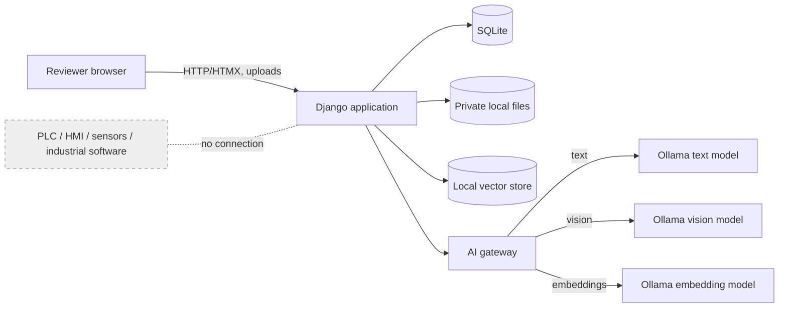
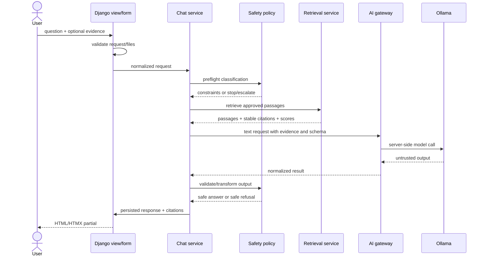
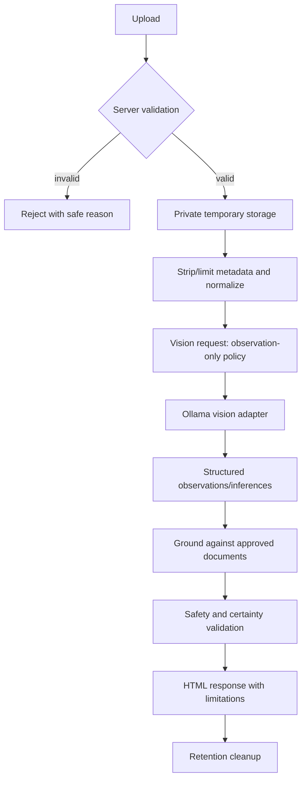
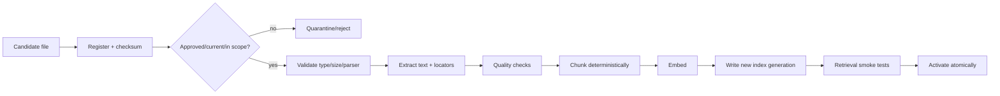
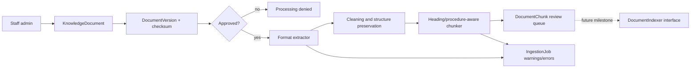
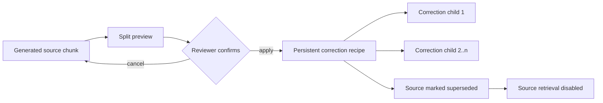
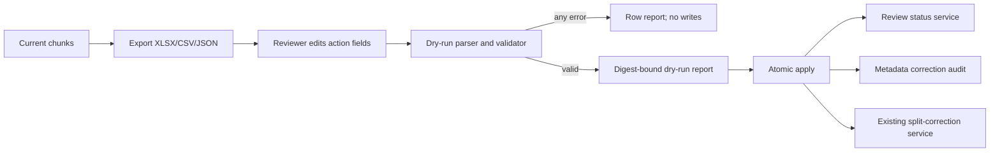

# Application Architecture

## 1. Context and boundaries

The prototype is a local, server-rendered Django application. Its only external runtime dependency is a local Ollama process. It has no industrial-system connection.



Trust boundary: the browser, uploaded content, retrieved document text, and model output are untrusted. Django performs validation, authorization where enabled, orchestration, policy enforcement, persistence, and redaction.

## 2. Django project and modules

Proposed project package: `manufacturing_agent`.

| Module | Prototype responsibility |
|---|---|
| `core` | home/status pages, shared template context, health/readiness abstractions |
| `accounts` | reserved Django authentication extension point; minimal/unused on localhost Plan A |
| `chatbot` | conversations, messages, feedback, views, forms, templates, HTMX partials |
| `knowledge_base` | document register, approval state, extraction, chunking, embeddings, indexing, retrieval, citations |
| `ai_gateway` | provider-neutral contracts, configuration, Ollama adapters, future cloud adapter boundary, errors/telemetry |
| `troubleshooting` | multi-turn symptom state, diagnostic question policy, structured response schema, escalation |
| `vision` | image validation, normalized metadata, vision requests, observation schema, temporary-file lifecycle |
| `safety` | deterministic input/output policy, forbidden-action detection, uncertainty labels, safe fallback/escalation |
| `evaluation` | fixed test cases, runs, scores, issue records, regression exports |

Apps may call shared service interfaces, not each other's views or templates. `chatbot` orchestrates a request through application services; it does not contain provider or parser logic.

## 3. Request and response flow



Safety is applied before and after generation. Citations originate from retrieved records, not from model-invented source strings.

## 4. RAG workflow

### Retrieval

1. Normalize the question and conversation context.
2. Apply scope/safety preflight.
3. Generate a query embedding through the embedding interface.
4. Search only active, approved chunks in the pilot collection.
5. Apply metadata filters and rank results.
6. Enforce relevance thresholds and context limits.
7. Build a bounded evidence package with stable source IDs and locators.
8. If evidence is inadequate, request information or answer with explicit insufficiency; do not fill gaps from model confidence.
9. Generate a structured answer.
10. attach only citations that correspond to retrieved chunks.

Retrieval parameters (chunking method, overlap, top-k, threshold, embedding model/version) are configuration recorded with each index build and test run.

### Grounded text generation

The chatbot calls the existing safety-first retrieval service with the active
index, configured top-k, and threshold. Results are revalidated at the
generation boundary, budgeted as complete chunks, and labeled `E1`, `E2`, and
so on. The existing text gateway sends these blocks to Ollama using a strict
JSON schema. Only validated evidence labels can become citations; document and
index metadata always comes from Django retrieval records.

Retrieval and generation fail closed independently. No qualifying evidence,
an unavailable or incompatible index, an insufficient-evidence model response,
or repeatedly malformed output produces a controlled response without raw
provider details. The calibrated `0.30` threshold applies specifically to the
reviewed `qwen3-embedding:0.6b` FANUC corpus and must be recalibrated if either
the embedding identity or corpus changes.

Normal users see answers, safety notices, and source cards. Only staff can see
scores, chunk/hash/index identities, latency, prompt size, and retry counts.
The application stores no hidden prompt or duplicate evidence content.

### Grounded answer shape

The internal response contract should support:

- `answer`;
- `confirmed_information`;
- `visible_observations`;
- `likely_causes`;
- `possible_causes`;
- `physical_verification_required`;
- `safe_next_checks`;
- `stop_and_escalate`;
- `citations`;
- `limitations`.

Fields not relevant to a request may be empty, but labels must remain unambiguous in rendered output.

## 5. Provider gateway

The gateway exposes separate provider-neutral protocols:

```text
TextGenerator.generate(TextRequest) -> TextResult
VisionAnalyzer.analyze(VisionRequest) -> VisionResult
Embedder.embed_documents(...) / embed_query(...) -> vectors
```

Each request carries timeouts and safe metadata. Each result normalizes model identity, duration, finish/error state, and content without leaking raw provider exceptions.

The gateway owns:

- provider selection and adapter construction;
- base URLs and model names;
- timeout/cancellation behavior;
- retry policy for safe transient failures;
- normalized errors;
- sensitive-value redaction;
- capability/readiness checks.

It does not own retrieval, domain prompts, Django views, safety policy, or HTML rendering.

### Local Ollama mode

- Ollama binds locally; Django reaches it server-side.
- Text, vision, and embedding model names are independent environment settings.
- Startup/readiness checks distinguish unavailable service, absent model, timeout, and invalid response.
- Routine tests mock adapters; explicitly marked integration tests use installed local models.
- The application must remain usable enough to display controlled guidance when Ollama is stopped.

Milestone 2 implements only the text interface. `TextGateway` applies validated
generation settings and calls an `LLMProvider` protocol. `OllamaProvider` is the
only adapter and uses HTTPX against `/v1/chat/completions`; `/v1/models` powers
the health check. The adapter accepts only HTTP loopback URLs ending in `/v1`.
Provider exceptions are translated into stable application errors before they
reach chatbot services. No raw provider body, URL, or credential is rendered to
the browser.

The chat service supplies the manufacturing system prompt, persists each user
and assistant message, and applies deterministic safety checks before and after
generation. Questions implying live access receive an application-enforced
statement that the chatbot is not connected to the machine.

### Future cloud mode

A future adapter may implement the same contracts for an approved API. API keys remain server-side. Provider selection is configuration-only for callers. Cloud-specific rate limits, budgets, privacy approval, retention, and production error handling are future work. No cloud adapter needs to make a real paid request during Plan A.

## 6. Image-analysis workflow



Validation includes allowed formats, detected MIME/type, byte and pixel limits, decoder success, filename/path safety, and decompression limits. The vision model reports observable features, not hidden-fault confirmation. OCR-like alarm text is treated as untrusted user evidence and checked against retrieved sources. A vision failure never falls back to pretending an image was inspected.

## 7. Document-ingestion workflow



Supported prototype formats are proposed as PDF, DOCX, XLSX, TXT, and common raster images where useful. Macro-enabled Office files, archives, executables, and active content are rejected. Scanned-PDF OCR is not an initial dependency; unreadable scans are flagged for correction or a later approved OCR decision.

Index builds are versioned by source checksum, parser/chunker version, embedding model, and settings. Replacement/removal must deactivate affected chunks and permit a clean rebuild.

## 8. Data storage

### SQLite

Stores users (if enabled), conversations, messages, feedback, document metadata/status, ingestion jobs, citations, evaluation cases/runs/results, issues, and configuration fingerprints—not secrets.

### Private local files

Stores approved source documents and controlled temporary uploads outside static files. Source files, uploads, generated indexes, databases, and logs are ignored by Git. Retention defaults are conservative and configurable; temporary files are cleaned after processing where audit requirements do not require retention.

### Vector store

Chroma is selected for the initial embedded persistent vector store (ADR-004). It stores chunk vectors and metadata on local disk. It is generated data and is rebuildable. Repository/domain services prevent Chroma-specific calls from spreading through Django apps.

### Logs

Structured local logs record correlation ID, operation, timings, sanitized error category, and provider/model identifier. They exclude secrets, full confidential document text, raw images, and unnecessary prompt/chat contents. Formal reviewer results belong in the database/exported test records, not only logs.

## 9. Security boundaries

| Boundary | Control |
|---|---|
| Browser → Django | CSRF, forms, request limits, escaping, controlled endpoints |
| Upload → storage/parser | allowlist plus content detection, limits, safe names, private paths, parser errors isolated |
| Approved source → RAG | approval/status filters, checksum/versioning, prompt-injection-resistant instructions |
| Retrieved text → model | bounded context, clear data delimiters, source metadata generated by application |
| Model → user | schema validation, deterministic safety checks, citation validation, safe fallback |
| Django → Ollama | server-side only, configured endpoint allowlist, timeouts, normalized errors |
| Configuration → runtime | environment loading, validation, redaction, no browser exposure |
| Generated index → application | disposable/rebuildable, version compatibility checks, atomic activation |

Document text may contain malicious instructions. It is evidence, never application policy. System/safety rules cannot be overridden by uploaded files, retrieved passages, model output, or user prompts.

## 10. Proposed repository structure

```text
.
├── .agent/
│   └── PLANS.md
├── docs/
│   ├── AI_Agent_in_Manufacturing_Official_Development_Draft_Updated.docx
│   ├── architecture.md
│   ├── decisions.md
│   └── open_questions.md
├── config/
│   └── prompts/                  # versioned text/safety prompt templates
├── manufacturing_agent/
│   ├── settings/
│   │   ├── base.py
│   │   ├── local.py
│   │   └── test.py
│   ├── urls.py
│   ├── asgi.py
│   └── wsgi.py
├── apps/
│   ├── core/
│   ├── accounts/
│   ├── chatbot/
│   ├── knowledge_base/
│   ├── ai_gateway/
│   ├── troubleshooting/
│   ├── vision/
│   ├── safety/
│   └── evaluation/
├── templates/
│   ├── base.html
│   └── components/
├── static/
│   ├── css/
│   └── vendor/                   # locally served HTMX/Bootstrap assets
├── tests/
│   ├── fixtures/
│   ├── regression/
│   └── integration/
├── scripts/                      # Windows-friendly setup/check helpers
├── var/                          # ignored runtime data
│   ├── documents/
│   ├── uploads/
│   ├── vector_store/
│   ├── logs/
│   └── exports/
├── manage.py
├── pyproject.toml
├── requirements.in
├── requirements-dev.in
├── requirements.txt             # compiled, pinned
├── requirements-dev.txt
├── .env.example
├── .gitignore
├── PROJECT_SPEC.md
├── EXECUTION_PLAN.md
└── AGENTS.md
```

No application directories or dependency files are created in this specification task.

## 12. Milestone 3 ingestion architecture

Approved source files remain private under `var/documents/`; Django serves no
media URL. Staff register and review source metadata in the admin before
processing.



`knowledge_base.extraction` supplies provider-neutral PDF, DOCX, TXT, and
Markdown extractors. Results are typed blocks with chapter, section, and page
provenance. No OCR is attempted: unusable input moves the job to manual review.

`knowledge_base.chunking` preserves headings, safety blocks, and numbered
procedures. Chunks inherit source and safety metadata. Content hashes identify
duplicates; stable IDs derive from version, sequence, and normalized content.

`knowledge_base.ingestion` owns approval checks, job state, extraction, chunk
replacement, and failure recording. Embedding, vector-store, and indexing
protocols exist only as future interfaces.

The staff-only preview shows extracted text, chunks, provenance, safety flags,
processing warnings, and extraction errors. Uploaded files are not public.

### Controlled chunk corrections

Generated chunks remain an immutable audit layer. A staff reviewer can create a
`ChunkSplitCorrection` recipe by inserting one or more split markers, previewing
the proposed children, correcting their metadata, and confirming safety
boundaries. Applying the recipe:



Correction children inherit the complete document/version governance metadata,
receive deterministic IDs and hashes, and occupy decimal sequence positions
between the source and next current chunk. Only current, explicitly enabled
content is eligible for future retrieval.

During reprocessing, all retrieval flags fail closed. An applied correction is
reconstructed only when exactly one regenerated source chunk has the recorded
content hash. No match or an ambiguous match marks the correction stale,
disables its children, and requires human revalidation. The original source and
correction record remain available for audit.

### Controlled bulk review

`knowledge_base.bulk_review` maps XLSX, CSV, and JSON files into the same
validated `ReviewRow` representation. Exported rows contain immutable identity,
hash, content, provenance, current review state, and reviewer-controlled action
columns. Spreadsheet files are size/row limited, formulas are rejected, and
CSV formula-like text is escaped.



Apply requires an unchanged successful dry-run report or explicit `--confirm`,
an authorized staff reviewer, and a fully valid batch. The command locks chunks
and rechecks hashes inside one database transaction. Any runtime error rolls the
whole batch back. Metadata corrections preserve content and provenance in
`ChunkMetadataCorrection`; split actions continue through
`ChunkSplitCorrection`.

### Correction-child replacement

An approved correction child with incomplete text can be replaced through
`knowledge_base.replacements`. The service never edits or deletes the reviewed
child. It marks that child superseded and non-current, creates one deterministic
`correction_replacement` child at the same sequence and provenance, and records
both hashes, content, reason, reviewer and document identity in
`ChunkReplacementCorrection`.

Reprocessing first reconstructs split children, then reapplies replacement
recipes in creation order. An exact child ID and source-hash match recreates the
same replacement ID. A mismatch marks the audit stale and leaves the
replacement retrieval-disabled.

The accepted FANUC replacement may end with trailing whitespace after its
required final sentence. Review validation treats only that trailing whitespace
as non-substantive by applying `rstrip()` (or equivalent) before the final
sentence comparison. Stored content is not rewritten for this purpose.

Correction recipes and their reviewed content are currently database-resident.
Migrations reproduce the schema, not the reviewed dataset, and runtime
databases and correction files are intentionally excluded from Git. Recreating
the same corrected dataset on another computer will require a future versioned
correction manifest or controlled dataset-reconstruction mechanism.

## 11. Proposed initial dependencies

Exact versions must be resolved and pinned at implementation time against a selected supported Python version; dependencies are not installed now.

### Runtime

| Package | Purpose |
|---|---|
| `Django` | web framework, ORM, forms, admin, uploads |
| `django-environ` | validated environment-based settings |
| `httpx` | time-bounded Ollama/provider HTTP client |
| `pydantic` | provider and structured-response boundary validation |
| `chromadb` | embedded persistent local vector store |
| `PyMuPDF` | PDF text extraction and page locators |
| `python-docx` | DOCX extraction |
| `openpyxl` | XLSX extraction |
| `Pillow` | safe image decoding, dimensions, normalization |
| `python-magic-bin` | content-based file type detection on Windows |
| `whitenoise` | simple local/static asset handling; production suitability reconsidered later |

HTMX and Bootstrap should be vendored as static assets for offline/no-cost local operation rather than loaded from public CDNs.

### Development and test

| Package | Purpose |
|---|---|
| `pytest`, `pytest-django` | test runner and Django integration |
| `pytest-cov` | coverage reporting |
| `pytest-timeout` | prevent hung provider tests |
| `responses` or `respx` | mock HTTP/provider behavior; choose the client-matching option |
| `freezegun` | deterministic time-based tests |
| `factory-boy` | explicit model factories |
| `ruff` | linting and formatting |
| `mypy`, `django-stubs` | type checking at service/model boundaries |
| `pip-tools` | reproducible pinned requirements |
| `bandit` | focused Python security checks |

No RAG orchestration framework is proposed initially; direct services reduce dependency weight and keep retrieval/provider behavior testable. Add one only through an ADR demonstrating a concrete need.

## Milestone 4 retrieval implementation

The embedding interface and Ollama adapter are separate from text generation.
Reviewed chunk content is never changed: indexing normalizes only line endings,
outer whitespace, and repeated blank lines, then records both the authoritative
source hash and normalized embedding-input hash.

One centralized eligibility queryset gates indexing, consistency checks, and
retrieval revalidation. Qdrant Local Mode stores disposable vectors beneath
`var/vector_store/`; Django stores index lifecycle, model identity, dimension,
corpus fingerprint, point identity, and provenance. A build creates a new
collection, embeds the complete eligible corpus, validates counts, writes
records, and only then atomically retires the previous index and activates the
new one. A failure leaves the previous active index intact.

Dense retrieval embeds the query, searches the active collection, then
revalidates every candidate's current eligibility and source hash in Django.
Safety-first mode deterministically prioritizes validated warning/caution
chunks only through a bounded ranking bonus after semantic-score filtering;
it never prepends safety-labelled content ahead of substantially more relevant
evidence. Results expose semantic score, final ranking score, applied safety
bonus, and ranking reason. A configured, model-specific minimum score permits abstention. Hybrid
retrieval and LLM reranking are not enabled because no approved evaluation
evidence currently justifies them.

The staff inspection page and management commands return ranked source chunks
and provenance only. Milestone 4 does not generate chatbot answers; grounded
answer generation belongs to Milestone 5. Reviewed correction recipes remain
database-resident and cannot yet be reconstructed from committed files alone;
this milestone does not solve that portability gap.

`knowledge_base.evaluation` validates the version-controlled JSON case schema
and invokes the same retrieval service used by search and staff inspection.
Only case-level `approved` records contribute to Hit@K, MRR, subset,
abstention, latency, or provenance metrics; `pending_review` and invalid cases
remain separately visible. Optional threshold calibration reruns approved
cases at each displayed candidate threshold and reports positive/negative
trade-offs without choosing or applying a production threshold. Detailed JSON
and concise Markdown reports carry the dataset digest, active index/model
identity, retrieval configuration, case outcomes, and aggregates under
Git-ignored `var/evaluation/`.
# Milestone 5.1 generation-provider extension

`TextGateway` remains the single generation boundary. Its explicit factory may
resolve either the local Ollama adapter or the Google Gemini adapter; neither
falls back to the other. Gemini uses the official non-streaming Interactions API
with `store=False`, no tools, and a conservative JSON Schema subset. The same
grounded prompt and application semantic validator apply to both providers.
Optional provider usage counts flow through provider-neutral result diagnostics.
Retrieval, evidence validation, and deterministic citation construction remain
local and unchanged.
